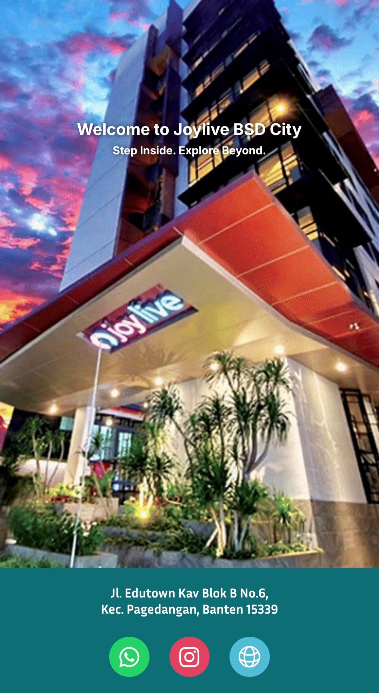
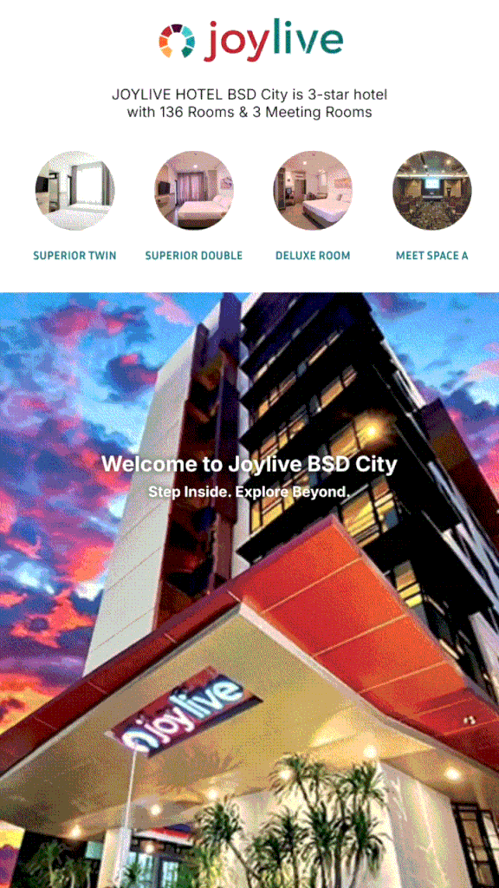
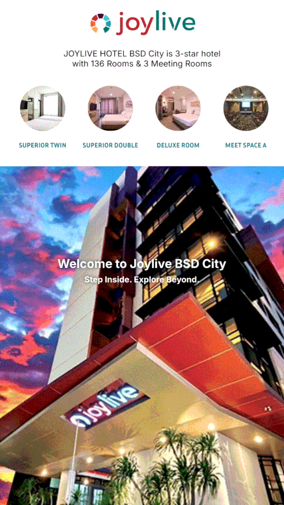

# Project Details
This is a project from my 5-month internship at Joylive BSD City. From a single concept, everything was sketched, drafted, designed, prototyped, coded, and launched from scratch.

This site uses:
* Plain HTML/CSS frontend
* Javascript
* Apache server
* Node JS server

## Features
<p align="center">
    
</p>

The site offers a highlight reel-like interface to display a digital showcase of rooms and facilities at [Joylive BSD City](https://www.google.com/maps/place/Joylive+BSD+City/@-6.302943,106.638214,17z/data=!4m9!3m8!1s0x2e69fb736dab5b15:0x62b024ef8f72d35f!5m2!4m1!1i2!8m2!3d-6.3029434!4d106.6382135!16s%2Fg%2F11rws99_jb?hl=en-US&entry=ttu&g_ep=EgoyMDI2MDQwOC4wIKXMDSoASAFQAw%3D%3D), which are listed below.
* Rooms (Superior/Deluxe)
* 3 Meeting Spaces
* *Soul Kitchen* Restaurant
* Gym
* Laundromat
* Musholla
* Spa

<p align="center">
  
  &nbsp;&nbsp;&nbsp;&nbsp;&nbsp;
  
</p>

Once a room icon is clicked, a video of its tour will play with custom controls, as well as the hotel's jingle on loop which can be turned off anytime through the floating icon on the bottom right.

## Usage
So far in it's development, this website uses a Google Drive folder with a service account to provide a CMS-like mechanism for hotel staff to change content anytime. It requires a separate Node server to run in the background for the Google API to fetch and load the media from the Drive folder.

To load the CMS, make sure you have [Node.js](https://nodejs.org/en/download) and PM2 installed.
``` cmd
npm install -g pm2
```
After that, navigate to the `cms` folder and run `npm install` which will install the requirements for the Express server and Google Drive API to run.
``` cmd
cd cms
npm install
```
Once everything is installed, register PM2 as a startup service for the server to run automatically. The startup only needs to be done once.
``` cmd
pm2-windows-startup installed
```
OR
``` cmd
npx pm2-windows-startup install
```
After PM2 is registered, start the server and save.
``` cmd
pm2 start ecosystem.config.js --env production
pm2 save
```
The server will now start automatically, but might take a while for the media to load.

## License
MIT